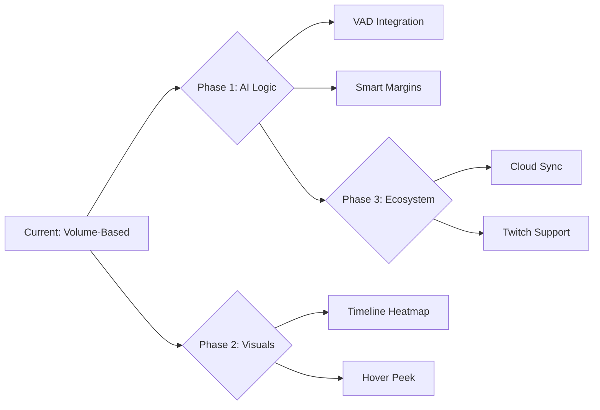

# 🚀 Jump Cutter: Future Features & Roadmap

Welcome to the future of **Jump Cutter**. This document outlines the proposed evolution of the extension, focusing on AI-enhanced accuracy, immersive UI/UX, and cross-platform automation.

---

## 🧠 AI & Intelligent Logic
*Precision skipping that understands context, not just decibels.*

> [!TIP]
> Moving beyond simple volume thresholds will eliminate the "mushed word" effect and make the cutting feel more natural.

### 🔇 Voice Activity Detection (VAD)
- **Feature**: Integrate a lightweight, WASM-based VAD (like *Silero*) to distinguish between human speech and background noise/music.
- **Benefit**: Silence speed will only trigger when NO speech is detected, preventing the extension from cutting off breathy words or soft sentence endings.

### ⚡ Smart Margin Auto-Tuning
- **Feature**: Logic that analyzes the speaker's cadence over the last 30 seconds and automatically updates "Margin Before/After".
- **Benefit**: Fast talkers get tight cuts; slow, deliberate speakers get more breathing room automatically.

---

## 🎨 Immersive UI & Visual Feedback
*Making the magic visible.*

### 🗺️ Timeline Heatmap
- **Feature**: A "ghost" progress bar overlay on YouTube/platform players showing:
  - 🟩 **Green**: Sounded sections.
  - 🟥 **Red**: Skipped/Speed-up sections.
- **Benefit**: Users can instantly see the "density" of a video and jump to high-content areas.

### 👁️ Hover-Peek
- **Feature**: Hovering over a skipped (red) section on the timeline shows a small picture-in-picture preview.
- **Benefit**: Quickly confirm if that 10-second pause was just silence or a visual-only demonstration (like screen-drawing).

---

## 🌐 Platform & Automation
*Jump Cutter, everywhere you are.*

### 🌍 Cloud-Synced Creator Profiles
- **Feature**: A community-driven database of "Best Settings" for specific YouTube channels.
- **Benefit**: When you open a *Veritasium* or *Linus Tech Tips* video, Jump Cutter automatically loads the community's preferred skipping threshold and speed.

### 📺 Twitch & Live Stream Support
- **Feature**: "Real-time Buffer Skipping" for live streams.
- **Benefit**: Catch up to "Live" faster by skipping silences in the buffered part of a broadcast.

---

## 🛠️ Advanced Tools (Power Users)
*For those who want more than just speed.*

| Feature | Description | Status |
| :--- | :--- | :--- |
| **Live Transcription** | Real-time text overlay of what's being skipped (so you don't miss a thing visually). | 💡 Proposed |
| **Skip Summary** | A report at the end of the video: "You saved 12 minutes. Here is a 1-sentence summary of the skipped parts." | 💡 Proposed |
| **Mobile Sync** | Share your local file skipping stats with the Firefox for Android extension. | 💡 Proposed |

---

## 🗺️ Roadmap Visualization

---

> [!IMPORTANT]
> **Use Superpowers**: To begin implementing any of these features, simply mention the feature name. We will then start a `brainstorming` session to finalize the design before moving to execution.
